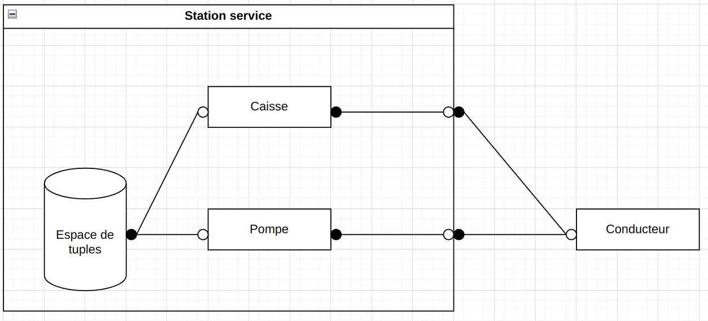
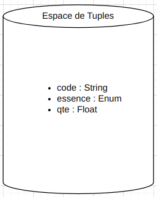

# Info801 - Station Service

## Conception
Tout d'abord, lors de ce TP, nous avons commencé par créer un schéma architectural. Après réflexion, nous avons convenu d'un schéma de type "Composants connecteur" pour représenter les différents éléments, ainsi que les espaces de tuples afin de représenter les données communiquées entre les clients et la station service, et à l'intérieur de la station service.

Le schéma auquel nous avons finalement aboutit est celui ci-dessous :

Les raisons de notres choix sur l'architecture sont les suivantes : 
- Faible couplage entre les composants (ex: Conducteur/Station Service)
- Création/suppression de pompes à la volée

La raison principale de pourquoi nous avons utilisé un espace de tuple est la suivante :
- Partage de données en temps réel entre plusieurs composants

Pour ce qui est des composants, nous avons :
<ol>
    <li>La station service</li>
    <li>Les pompes</li>
    <li>La caisse</li>
    <li>L'espace de tuples des codes</li>
    <li>Les clients</li>
</ol>

Pour ce qui est des connecteurs, nous avons :

- Deux connecteurs entre les clients et la station service (un où le client est provider, et un où il est required), représentant les différentes actions que le client peut effectuer à la station (ici acheter de l'essence, faire le plein, et se renseigner sur son code)

- Deux connecteurs entre la caisse et la station permettant l'interaction entre la caisse et l'extérieur

- Deux connecteurs entre une pompe et la station permettant l'interaction entre cette pompe et l'extérieur

- Deux connecteurs entre la caisse et l'espace de tuples afin d'envoyer et recevoir des tuples enregistrés pour le bien du système

- Deux connecteurs entre une pompe et l'espace de tuples afin d'envoyer et recevoir des tuples enregistrés pour le bien du système

Pour ce qui est de l'espace de tuples, nous avons convenu du schéma suivant :

 

Les tuples ont pour forme `<code: String, essence: EssenceType, qte: Integer>`.
Chaque tuple représente un code acheté et encore valable.
EssenceType est un énumérateur représentant les différents types d'essences dans la station.
L'espace de tuple concentre donc tous les codes des clients qui ont acheter de l'essence, et qui sont encore valides (c'est-à-dire qu'il reste une quantité non-nulle de carburant à distribuer).

## Réalisation
Pour réaliser ce système, nous avons choisis d'utiliser python, avec une approche orienté-objet typé.

La partie conception étant réalisée et comprise, nous avons donc facilement implémenté les différentes composantes du sytème (à savoir la station service, la caisse, les pompes et l'espace de tuples).
Cependant, il nous fallait implémenter un moyen de communiquer avec un conducteur, ainsi que d'unifier les types d'essence.
C'est pourquoi nous avons créer la classe `Ticket` et l'énumérateur `EssenceType`.

Pour stocker les données qu'on utilise, l'espace de tuple est une classe qui contient un dictionnaire, avec pour clé le code, et comme valeur de tuple `<TypeEssence|Quantité>`. 

De plus, pour représenter les liens entre les différents services, nous avons implémenté une super classe `ObjectConnectable` qui contient une liste d'`ObjectConnectable` ainsi que ses getter / setters. Cette classe nous permet d'instancier une connection entre plusieurs services. Ainsi il nous est plus aisé de faire communiquer la caisse avec l'espace de tuple, par exemple.
On parle de super classe, car toutes les classes des différents composants (Station Service, Espace de Tuple, Caisse, Pompe) héritent de cette classe.

## Comment l'utiliser
<ol>
    <li>Cloner ce <a href="https://github.com/romain22222/INFO801-TP-SS">répertoire git</a></li>
    <li>Aller dans le répertoire source du projet</li>
    <li>Exécuter la commande suivante <code>python main.py</code> et laissez-vous guider par l'IHM ^^</li>
</ol>